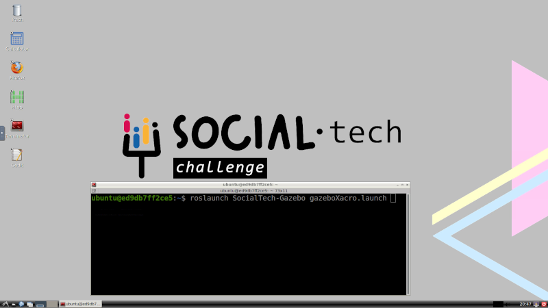
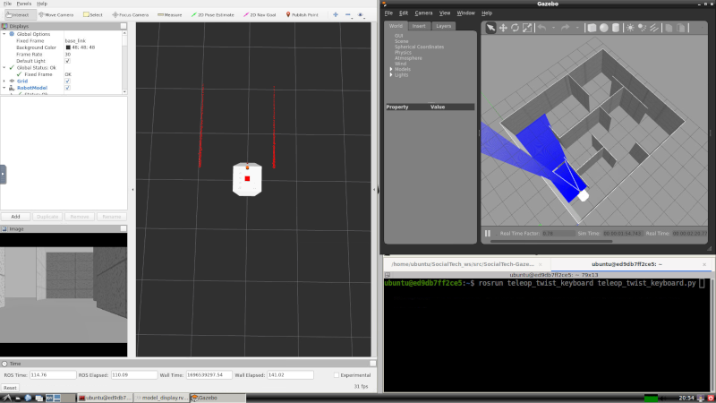

# Contenedor docker para uso en SocialTech-Challenge

Este contenedor contiene todos los ficheros necesarios para poder comenzar a trabajar desde el minuto cero. Al arrancar el contenedor ya se pueden realizar simulaciones, simplemente accediendo mediante un navegador web a la dirección http://127.0.0.1:6080 y utilizando la contraseña mypasswd.

Incluso se puede utilizar desde windows, es necesario contar con una tarjeta gráfica nvidia. Pero para ello es necesario instalar WSL2 y Docker Desktop.

## Instalar WSL2 en windows 11

Ahora puedes instalar todo lo que necesitas para ejecutar WSL con un solo comando. Abre PowerShell o el Símbolo del sistema de Windows en modo de administrador haciendo clic derecho y seleccionando "Ejecutar como administrador", ingresa el comando wsl --install y luego reinicia tu máquina.

    wsl --install

## Instalando Docker Desktop para Windows

Docker Desktop for Windows es la Edición Comunitaria (CE) de Docker para Microsoft Windows. Para descargar Docker Desktop for Windows, dirígete a Docker Hub.

Enlace: https://hub.docker.com/editions/community/docker-ce-desktop-windows

La instalación proporciona Docker Engine, el cliente Docker CLI, Docker Compose, Docker Machine y Kitematic. Los contenedores e imágenes creados con Docker Desktop for Windows se comparten entre todas las cuentas de usuario en las máquinas donde está instalado. Esto se debe a que todas las cuentas de Windows utilizan la misma máquina virtual (VM) para construir y ejecutar contenedores.

# Clonar y ejecutar el contenedor de SocialTech-Challenge

Presiona las teclas windos+R a la vez. En la ventana emergente escribe ***cmd*** y elecuta el comando.

En la ventana negra resultande escribe el siguiente comando:

    git clone https://github.com/SocialTech-Challenge/SocialTech-NOVNC.git

Esto descargará el repositorio que contiene todos los comandos para generar el contenedor con todos los paquetes instalados. Una vez finalizado ejecuta:

    cd SocialTech-NOVNC
    docker compose build

Este proceso llevará bastante la primera vez. Al finalizar puedes ejecutar la siguiente instrucción:

    docker compose up

Esto levantará el contenedor y sin cerrar esta ventana ve a un navegador web y accede a la siguiente dirección http://127.0.0.1:6080, la clave que te pedirá es ***mypasswd***

Dentro del contenedor abre el terminal ***Terminator*** y ejecuta el siguiente comando:

    roslaunch SocialTech-Gazebo gazeboXacro.launch

Se abrirá el RVIZ y el simulador Gazebo. Distribuye las ventanas al gusto, por ejemplo como en la siguiente imagen:

En una nueva pestaña del terminator (sin cerrar la anterior) ejecuta el comando:

    rosrun teleop_twist_keyboard teleop_twist_keyboard.py

**Ya puedes mover el AGV utilizando el teclado.**
